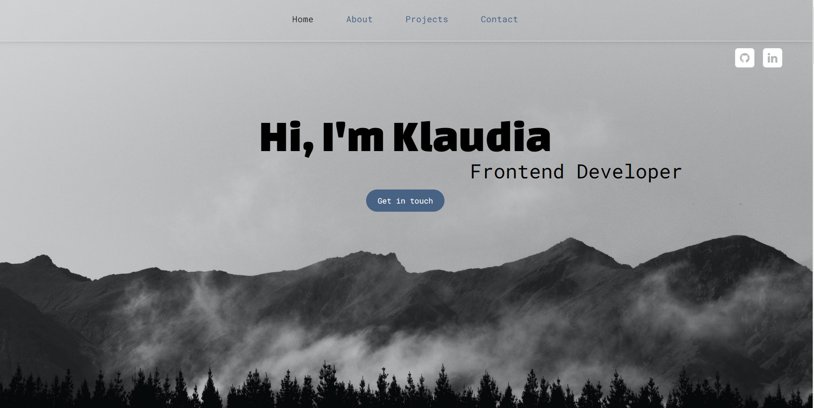

# Portfolio Website

The project is a simple website that serves as my portfolio. The site includes a short description about me, my projects and contact details.

## Page contains:

- Sticky navigation,
- Scroll Up Button,
- Hover states for all interactive elements on the page,
- The optimal layout for the site depending on their device's screen size

## Screenshot

## Demo

- Live Site URL: [Live Demo](https://xakashax.github.io/portfolio/)

## Built with

- HTML5
- CSS3
- Flexbox and Grid
- JS
- Photoshop
- Bootstrap 5
- Lordicon
- Figma

## Photos

- Photo in header by Tyler Lastovich from unsplash.com (https://unsplash.com/photos/hM08wZJBlK4?utm_source=unsplash&utm_medium=referral&utm_content=creditCopyText)
- The rest of the photos are taken by me
